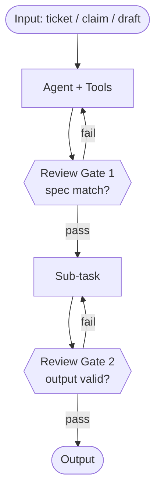
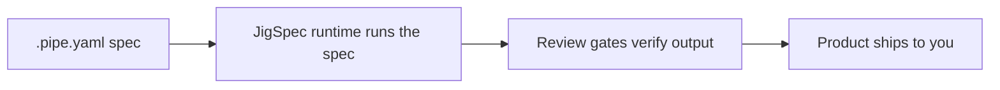

# Phase 04: Diagrams, Polish & Preview Soak — Research

**Researched:** 2026-04-30
**Domain:** Mermaid client-side rendering with viewport-gated lazy load; static-site polish (OG image, sitemap, custom 404, accessibility); preview-URL soak instrumentation; manual cold-read review.
**Confidence:** HIGH (Mermaid + lazy-load patterns verified via direct source-code inspection of `astro-mermaid@2.0.1` and Mermaid 11 official docs); MEDIUM-HIGH (Vercel static 404 edge cases — documented but version-shifting); HIGH (Lighthouse + soak protocol).

<user_constraints>
## User Constraints

> No `04-CONTEXT.md` exists for Phase 4 — this section derives the constraint set from REQUIREMENTS.md (DIAGRAM-01..05, VISUAL-05), ROADMAP.md (Phase 4 success criteria), PROJECT.md (visual + voice + analytics constraints), and both CLAUDE.md files. Treat the items below with the same authority as locked decisions, since they are upstream artifacts.

### Locked Decisions (from upstream)
- **Astro 6 + Tailwind 4 + TypeScript strict** — already shipped Phases 01–03; Phase 4 does not change the stack.
- **Static output (`output: 'static'`)** — no SSR, no Vercel adapter; Mermaid renders client-side only.
- **Mermaid 11 client-side via `mermaid` npm package** — NOT a CDN. Loaded via dynamic `import('mermaid')` so Vite code-splits it into its own chunk.
- **Lazy-load by viewport (DIAGRAM-03 — non-negotiable)** — visitors who never scroll to a diagram MUST NOT download the ~700KB Mermaid runtime. The IntersectionObserver gate is the requirement, not an implementation suggestion.
- **2 diagrams only on home page** — DIAGRAM-01 ("How an agentic pipeline runs", with **visible review gates** as an explicit node) and DIAGRAM-02 ("How JigSpec ships a product to you", 4–5 nodes max). Each captioned.
- **Mobile-first legibility at 320 / 375 / 414 px** — horizontal scroll on the diagram element is acceptable; illegible nodes are not.
- **Build-time SVG fallback path documented but NOT pre-installed** — only swap to `mmdc` if Lighthouse mobile-perf fails the soak gate. v1 ships client-side render.
- **External cold-read review (VISUAL-05)** — at least 1 person who has never seen the page articulates JigSpec's value in their own words within 60 seconds. Same protocol as the Phase 2 SC#5 cold-read; this is a manual gate, not a build artifact.
- **PostHog free tier with `is:inline` snippet pattern** — already wired in Phase 3 (`src/components/Analytics.astro`). Phase 4 only consumes the typed wrapper (`src/lib/analytics.ts`) for the `diagram:view` event, which Phase 3 already wires against the placeholder.
- **CSP locked in `vercel.json`** — Phase 4 ships no new external script/style hosts. Mermaid is bundled (same-origin), `og.png` is same-origin static, sitemap is same-origin XML.
- **No backend in v1** — soak gate is observation only (browser console, PostHog ingestion warnings, Lighthouse) — no logging endpoint, no error-tracking SaaS beyond PostHog `$exception` autocapture.

### Claude's Discretion
- **Exact Mermaid diagram source** for DIAGRAM-01 + DIAGRAM-02 — node labels, edge labels, layout direction (TD vs LR), and whether DIAGRAM-01 uses `flowchart` or `sequenceDiagram`. Constraint: DIAGRAM-01 must show review gates as visible nodes (not edge labels); DIAGRAM-02 must be ≤5 nodes.
- **Theme strategy for dark/light parity** — Mermaid 11 supports `theme: 'base'` + `themeVariables`, or `theme: 'dark'`/`'default'`. Coordinate with `data-theme` attribute on `<html>` (already shipped in `Base.astro`).
- **Whether to use a single `<MermaidDiagram>` component with a `source` prop** vs two distinct components. Recommendation: keep the single component, pass `source` as a slot or string prop.
- **Soak duration in real wall-clock hours** beyond the ≥24h floor (could go 48–72h if traffic is sparse and we want more PostHog data points).
- **Exact 404 strategy** — Astro `src/pages/404.astro` with a Vercel `errorPage` directive vs static `public/404.html`. Both viable; pick based on whether the 404 needs Tailwind-generated styles.
- **OG image creative** — 1200×630 PNG. Must reflect editorial aesthetic (Pitfall 7); could be a typography-heavy "JigSpec" wordmark with the tagline.

### Deferred Ideas (OUT OF SCOPE)
- **Lighthouse CI in GitHub Actions** — over-engineered for a 1-page site at the current velocity. v1 uses manual PageSpeed Insights or Vercel's built-in Speed Insights. Add `@lhci/cli` only if/when the site grows to ≥3 routes AND we observe regressions.
- **Per-post OG image generation (Satori + `@vercel/og`)** — deferred to v2 blog phase. Static `og.png` is the v1 plan per CLAUDE.md.
- **Build-time SVG pre-rendering** — only triggered if soak fails Lighthouse mobile-perf. Documented as a fallback recipe, not implemented.
- **`rehype-mermaid`** — heavier than `mmdc` (Playwright vs Puppeteer); rejected as fallback option.
- **`@rendermaid/core`** — JSR-only, flowcharts-only, ≤1.0 release; rejected as fallback option (research below documents why `mmdc` wins).
- **Lighthouse-CI assertion thresholds in repo** — defer to v2; v1 records actual scores in soak summary.
- **Sentry / external error tracking** — PostHog `$exception` autocapture is the v1 source of truth; do not introduce Sentry.
</user_constraints>

<phase_requirements>
## Phase Requirements

| ID | Description | Research Support |
|----|-------------|------------------|
| DIAGRAM-01 | Mermaid Diagram 1: "How an agentic pipeline runs" — input → agent → tools → **visible review gates** → output, captioned to tie to CONTENT-01 reliability claim. | Pattern 1 (IntersectionObserver lazy load). The "visible review gates" requirement constrains the diagram source: review gates must be discrete graph nodes, not edge labels — Mermaid `flowchart` syntax with `Gate{{Review Gate}}` (rhombus/decision shape) is the standard pattern. |
| DIAGRAM-02 | Mermaid Diagram 2: "How JigSpec ships a product to you" — 4–5 nodes max, captioned. | Same Pattern 1. The ≤5-node constraint forces a `flowchart LR` (left-to-right) layout for mobile-readability. |
| DIAGRAM-03 | Lazy-load via IntersectionObserver + dynamic `import('mermaid')` — visitors who never scroll never download Mermaid. | Pattern 1 (full code below). **Verified via source inspection that `astro-mermaid@2.0.1` does NOT do this** — it loads Mermaid eagerly on page load if any `pre.mermaid` exists in DOM. We must implement the IO gate manually. |
| DIAGRAM-04 | Mobile legibility at 320 / 375 / 414 px. Horizontal scroll on the element OK; illegible nodes NOT OK. | Pattern 2 (CSS for the diagram wrapper). Mermaid SVG ships with intrinsic width; wrap in `overflow-x: auto` and let the SVG determine its own scroll width. Test in Chrome DevTools device toolbar. |
| DIAGRAM-05 | Build-time-SVG fallback documented (`@rendermaid/core` or `mmdc`) ready to swap in if Lighthouse mobile-perf gate fails. | Pattern 3 (build-time `mmdc` recipe). `mmdc` wins over `@rendermaid/core` (broader syntax support, Puppeteer-backed but battle-tested, official Mermaid project). |
| VISUAL-05 | External cold-read review — ≥1 person describes JigSpec in own words within 60 s. | Pattern 4 (cold-read protocol — manual, identical to Phase 2 SC#5). |
| **Soak gate (ROADMAP SC#5)** | ≥24 h at preview URL with: zero browser-console errors; zero PostHog ingestion warnings; custom 404 works; OG image renders in social-card debuggers; favicon ships; accessibility audit passes (focus rings, alt text, semantic landmarks); Lighthouse ≥95 perf/a11y/SEO/best-practices; 16-item PITFALLS.md "Looks Done But Isn't" checklist clean. | Pattern 5 (soak protocol). Pattern 6 (a11y static analysis with `eslint-plugin-jsx-a11y`). Pattern 7 (Lighthouse via PageSpeed Insights). Pattern 8 (PostHog `$exception` autocapture — must be enabled in PostHog project Settings UI; Phase 4 user-action item). |
</phase_requirements>

## Summary

Phase 4 is a **client-side rendering polish and observability phase**, not a feature phase. The two largest risks are (1) Mermaid loading-strategy correctness (DIAGRAM-03 mandates a viewport gate that the obvious community integration `astro-mermaid` does not provide), and (2) the soak gate sliding from rigorous to performative — i.e., declaring "looks done" without driving each of the 16 PITFALLS.md checklist items to ground.

The first risk is resolved by **directly inspecting `astro-mermaid@2.0.1`'s source code** (line 316 onward in `astro-mermaid-integration.js`): the integration calls `initMermaid()` immediately when any `pre.mermaid` element is detected on the initial DOM. There is no IntersectionObserver. This is documented behavior — `astro-mermaid` is optimized for docs-style pages where every diagram should render on load. JigSpec's marketing-page hero requires the opposite: most visitors bounce before scrolling to the diagrams, and the ~700KB Mermaid bundle dominates the mobile-perf score. **Recommendation: do NOT install `astro-mermaid`. Implement the IntersectionObserver + dynamic-import pattern directly in `MermaidDiagram.astro`.**

The second risk is resolved by treating the soak as a checklist-driven exercise (the 16-item PITFALLS.md list is the spine), not a "vibes" check. The soak deliverable is a `04-NN-SUMMARY.md` that records the actual measurement for each item — Lighthouse scores, PostHog ingestion-warning count, console-error count, screenshot of OG-image debugger response — not just a "verified ✓".

**Primary recommendation:** Build `MermaidDiagram.astro` as a self-contained component that owns its own IntersectionObserver, calls `import('mermaid')` once on first viewport entry across the page, calls `mermaid.render(id, source)` per instance, and injects the resulting SVG. Defer `astro-mermaid`, `@rendermaid/core`, and `mmdc` install until proven needed by a soak failure.

## Architectural Responsibility Map

| Capability | Primary Tier | Secondary Tier | Rationale |
|------------|-------------|----------------|-----------|
| Mermaid SVG rendering | Browser / Client | — | Static-output build cannot run a headless browser; Mermaid is loaded lazily into the visitor's runtime. |
| Diagram source authoring | Build-time (Astro template) | — | Source strings live in `.astro` files at build, passed to runtime as props. No CMS, no dynamic fetch. |
| Lazy-load gating | Browser / Client | — | IntersectionObserver is a browser API; cannot run server-side. |
| OG image | CDN / Static | — | Single `og.png` shipped in `/public/`; Vercel serves at edge. |
| Sitemap | Build-time | — | `@astrojs/sitemap` emits `sitemap-index.xml` + `sitemap-0.xml` at build. |
| 404 page | Build-time + Vercel routing config | — | Astro generates `dist/404.html`; Vercel serves it via `errorPage` config OR `public/404.html` direct drop-in. |
| Console-error / ingestion-warning observation | Browser / Client (DevTools) + PostHog UI | — | No backend. PostHog dashboard is the single observability surface. |
| Lighthouse audit | External (PageSpeed Insights API) | — | One-shot manual run at `https://pagespeed.web.dev/` against the preview URL. |
| Cold-read review | Manual / Out-of-band | — | Human reviewer + 60-second timer; recorded in soak summary. |

## Standard Stack

### Core (already installed — Phase 4 does NOT change these)
| Library | Version | Purpose | Why Standard |
|---------|---------|---------|--------------|
| `astro` | 6.1.10 (latest 6.2.1) | Static site generator | Phase 1 lock. No upgrade in Phase 4. [VERIFIED: package.json] |
| `@tailwindcss/vite` | 4.2.4 | Tailwind 4 Vite plugin | Phase 1 lock. [VERIFIED: package.json] |
| `tailwindcss` | 4.2.4 | Utility CSS engine | Phase 1 lock. [VERIFIED: package.json] |
| `typescript` | 5.9.3 (strict) | Type safety | Phase 1 lock. [VERIFIED: package.json] |
| `posthog-js` (via inline snippet) | latest array.js | Analytics | Phase 3 lock — loaded via `<script is:inline>`, not npm install. [VERIFIED: Phase 3 plans] |

### Phase 4 Additions
| Library | Version | Purpose | Why Standard |
|---------|---------|---------|--------------|
| `mermaid` | ^11.4.1 (latest stable on npm 2026-04) | Diagram runtime — loaded via dynamic `import('mermaid')` so Vite emits it as its own JS chunk that downloads only on first viewport entry | Mermaid 11 is the current major; v11 stabilized the `mermaid.render()` Promise API. [CITED: https://mermaid.js.org/config/usage.html] |
| `@astrojs/sitemap` | ^3.7.2 | Auto-emit `sitemap-index.xml` + `sitemap-0.xml` at build for SEO | Standard Astro integration; one-line config. [CITED: https://docs.astro.build/en/guides/integrations-guide/sitemap/] |

### Phase 4 Deferred (DO NOT install in v1)
| Library | When to add |
|---------|-------------|
| `astro-mermaid` | Never on this codebase as long as DIAGRAM-03 stands. Source inspection confirms it does not viewport-gate. |
| `@mermaid-js/mermaid-cli` (`mmdc`) | Only if Lighthouse mobile-perf < 95 after the client-side ship; would generate `dist/diagrams/*.svg` at build and swap `<MermaidDiagram>` to render ``. |
| `@rendermaid/core` | Never. JSR-only (not on npm), flowcharts-only, single-maintainer, pre-1.0. Riskier than `mmdc` for production fallback. |
| `rehype-mermaid` | Never. Heavier than `mmdc` (Playwright vs Puppeteer); no advantage. |
| `@vercel/og` + `satori` + `sharp` | Defer to v2 blog phase per CLAUDE.md. |
| `@lhci/cli` + `treosh/lighthouse-ci-action` | Defer to v2 multi-route phase. |
| `@astrojs/vercel` | Only if SSR routes ship. v1 stays static. |

### Alternatives Considered
| Instead of | Could Use | Tradeoff |
|------------|-----------|----------|
| Manual IO + dynamic import | `astro-mermaid@2.0.1` | astro-mermaid is one config line, but it loads Mermaid on page load — fails DIAGRAM-03. Would need to fork to add IO gating, or live with the perf cost. Manual implementation is ~30 LOC and already designed in Pattern 1 below. |
| `mmdc` build-time SVG | `@rendermaid/core` | rendermaid is JSR-only (not npm), supports flowcharts only (not sequence/state), pre-1.0, single maintainer. mmdc is the official `@mermaid-js/mermaid-cli`, supports all syntaxes, Puppeteer-backed (heavy but battle-tested). [VERIFIED: npm view + github inspection] |
| `@astrojs/sitemap` | Hand-rolled XML in `public/sitemap.xml` | One-line install vs hand-rolling means future routes auto-update the sitemap. Hand-rolled bit-rots the moment any new page (blog, /products) ships. |

### Installation
```bash
npm install --save-dev mermaid@^11.4.1
npx astro add sitemap
```

**Version verification (run at execution time):**
```bash
npm view mermaid version
npm view @astrojs/sitemap version
```
Document the verified versions in the plan; pin majors only — let dependabot bump minors.

## Architecture Patterns

### System Architecture Diagram

```mermaid
flowchart TD
  Visitor[Visitor lands on /] --> Index[index.astro composed of Hero + ProductGrid + 2x MermaidDiagram + ProblemPitch + Footer]
  Index --> Initial[Initial paint: HTML + Tailwind CSS + small inline JS]
  Initial --> Above[Above-the-fold: Hero, ProductGrid]
  Initial --> Below[Below-the-fold: 2x MermaidDiagram placeholder skeleton]
  Below --> IO[IntersectionObserver registered per MermaidDiagram instance]
  IO -->|First scroll near diagram| Lazy[Dynamic import('mermaid') — Vite-emitted chunk ~700KB]
  Lazy --> Init[mermaid.initialize once globally]
  Init --> RenderLoop[For each viewport-entered diagram: mermaid.render id, source]
  RenderLoop --> SVG[Inject SVG into placeholder]
  SVG --> Track[track 'diagram:view' { diagram_id } via src/lib/analytics.ts — already wired in Phase 3]
  Track --> PostHog[PostHog us.i.posthog.com event]

  Initial --> Sitemap[/sitemap-index.xml emitted at build by @astrojs/sitemap]
  Initial --> OG[/og.png static — referenced from Base.astro meta tag]
  Initial --> NotFound[/404.html — Vercel errorPage routes 404 to it]
  Initial --> Errors[$exception autocapture — wraps window.onerror + onunhandledrejection]
  Errors --> PostHog
```

### Component Responsibilities

| Component | File | Responsibility |
|-----------|------|----------------|
| `<MermaidDiagram>` | `src/components/diagrams/MermaidDiagram.astro` | Owns the placeholder, registers an IO instance, calls `import('mermaid')` on first entry, calls `mermaid.render()` and injects SVG, fires `track('diagram:view', { diagram_id })`. Phase 4 rewrites this from the Phase 2 placeholder. |
| `<Base>` | `src/layouts/Base.astro` | Adds `<meta property="og:image" content="/og.png">`, `<meta property="og:image:width" content="1200">`, `<meta property="og:image:height" content="630">`. Already has `data-theme` reflection script (Phase 2). |
| `index.astro` | `src/pages/index.astro` | Adds 2x `<MermaidDiagram diagramId="pipeline-run" source="..." caption="..." />` instances at the agreed-upon section locations (after the agentic-AI explainer for DIAGRAM-01; before the "tell us a problem" capture for DIAGRAM-02). |
| `404.astro` | `src/pages/404.astro` | New file — branded 404 with link back to `/`. |
| `astro.config.mjs` | root | Adds `sitemap()` to `integrations: []`. |
| `vercel.json` | root | Possibly adds `errorPage` directive routing 404s to `/404.html`. |
| `public/og.png` | root/public | New static asset — 1200×630 PNG. |

### Recommended Project Structure (deltas from existing)
```
src/
├── components/
│   └── diagrams/
│       └── MermaidDiagram.astro    # REWRITTEN in Phase 4 — Pattern 1
├── pages/
│   ├── 404.astro                    # NEW — Pattern 9
│   └── index.astro                  # MODIFIED — adds 2x <MermaidDiagram> instances
public/
├── og.png                           # NEW — 1200×630
└── 404.html                         # OPTIONAL — alternative to src/pages/404.astro
```

### Pattern 1: Viewport-gated Mermaid (DIAGRAM-03 — primary)

**What:** Single component that owns an IntersectionObserver. First instance to enter the viewport triggers the dynamic import; subsequent instances reuse the cached module.

**When to use:** Always. This is the v1 pattern.

**Source:** Synthesized from Mermaid 11 official docs (https://mermaid.js.org/config/usage.html) and inspection of `astro-mermaid-integration.js` lines 316–462 (verified that integration does NOT do this; we implement directly).

```astro
---
// src/components/diagrams/MermaidDiagram.astro
interface Props {
  diagramId: 'pipeline-run' | 'ship-to-you';
  source: string;
  caption: string;
}
const { diagramId, source, caption } = Astro.props;
// Server-render a unique DOM id so multiple instances coexist.
const slotId = `mermaid-${diagramId}-${Math.random().toString(36).slice(2, 8)}`;
---
<figure class="my-12">
  <div
    id={slotId}
    data-mermaid-source={source}
    data-diagram-id={diagramId}
    class="mermaid-slot overflow-x-auto"
    aria-label={`Diagram: ${caption}`}
    role="img"
  >
    <div class="border-2 border-dashed border-muted/30 rounded-md p-12 text-center">
      <p class="font-display text-2xl text-muted">Loading diagram…</p>
    </div>
  </div>
  <figcaption class="mt-3 text-sm text-muted text-center italic">{caption}</figcaption>
</figure>

<script>
  import { track } from '../../lib/analytics';

  // Single shared promise — first slot to intersect triggers the import; the rest await the same Promise.
  let mermaidPromise: Promise<typeof import('mermaid').default> | null = null;

  function getMermaid() {
    if (!mermaidPromise) {
      mermaidPromise = import('mermaid').then((m) => {
        const mermaid = m.default;
        const isDark = document.documentElement.dataset.theme === 'dark';
        mermaid.initialize({
          startOnLoad: false,
          theme: isDark ? 'dark' : 'default',
          securityLevel: 'strict',
          fontFamily: 'inherit',
        });
        return mermaid;
      });
    }
    return mermaidPromise;
  }

  async function renderSlot(slot: HTMLElement) {
    const source = slot.dataset.mermaidSource;
    const diagramId = slot.dataset.diagramId;
    if (!source || !diagramId) return;
    try {
      const mermaid = await getMermaid();
      const renderId = `mermaid-render-${slot.id}`;
      const { svg } = await mermaid.render(renderId, source);
      slot.innerHTML = svg;
      track('diagram:view', { diagram_id: diagramId as 'pipeline-run' | 'ship-to-you' });
    } catch (err) {
      console.error(`[MermaidDiagram] render failed for ${diagramId}:`, err);
      slot.innerHTML = '<p class="text-sm text-muted text-center italic">Diagram failed to load. <a href="/">Refresh the page</a> to retry.</p>';
    }
  }

  function observe(slot: HTMLElement) {
    if (!('IntersectionObserver' in window)) {
      // Fallback: render eagerly on browsers without IO (very old; <1% in 2026).
      renderSlot(slot);
      return;
    }
    const io = new IntersectionObserver(
      (entries) => {
        for (const entry of entries) {
          if (entry.isIntersecting) {
            io.disconnect();
            renderSlot(entry.target as HTMLElement);
          }
        }
      },
      { rootMargin: '200px 0px' }, // start loading just before fully visible
    );
    io.observe(slot);
  }

  // Register all slots on this page.
  for (const slot of document.querySelectorAll<HTMLElement>('.mermaid-slot')) {
    observe(slot);
  }
</script>
```

**Key design notes:**
1. **One shared `mermaidPromise`** — first slot to intersect triggers `import('mermaid')`; all subsequent slots reuse the cached module. Vite emits `mermaid` as its own chunk (verify with `npm run build` — should see a `mermaid-*.js` chunk in `dist/_astro/`).
2. **`rootMargin: '200px 0px'`** — start loading 200px before the slot is fully visible so the SVG paints just as the user scrolls in. Tune if needed; 0 is also acceptable.
3. **`track('diagram:view', ...)` after successful render** — replaces the Phase 3 placeholder observer (Phase 3 wires `diagram:view` against the `[data-diagram-id]` placeholder; Phase 4's slot retains that data attribute, so Phase 3's observer still fires — but Phase 4 fires it from inside the render success path for tighter semantics. **Coordinate with Phase 3 plan to remove the duplicate observer if both fire.**).
4. **`securityLevel: 'strict'`** — Mermaid's safest XSS posture. Strips `<script>` and click handlers from diagram source. Required for any user-influenced source (not the case here, but the right default).
5. **Accessibility:** `role="img"` + `aria-label={caption}` makes the diagram one announcement to screen readers (the caption already describes it). The SVG nodes inside are not individually navigable, which is correct — Mermaid SVGs are not built for screen-reader traversal.

### Pattern 2: Mobile legibility (DIAGRAM-04)

**What:** Wrap each diagram in `overflow-x-auto`. Mermaid SVGs ship with intrinsic width; let the browser scroll horizontally if the diagram exceeds the viewport.

**When to use:** Always.

```css
/* tailwindcss v4 — included via `class="overflow-x-auto"` in Pattern 1 */
.mermaid-slot {
  /* Tailwind class `overflow-x-auto` already applies overflow-x: auto. */
  /* Add scroll affordance for mobile users: */
  -webkit-overflow-scrolling: touch;
}
.mermaid-slot svg {
  display: block;
  margin: 0 auto;
  /* Ensure node labels remain ≥14px at all viewport widths */
  font-size: max(14px, 1em);
}
```

**Verification:** Open Chrome DevTools → Device toolbar → cycle through 320 / 375 / 414 px. For each viewport, every diagram node label must be ≥14px and readable. If any node compresses, simplify the diagram source (fewer nodes per row) before resorting to font-size hacks.

### Pattern 3: Build-time SVG fallback (DIAGRAM-05 — documented, not implemented)

**What:** If client-side render causes Lighthouse mobile-perf < 95, swap to build-time SVG using `mmdc`.

**When to use:** ONLY if soak gate fails on mobile-perf.

**Source:** Official Mermaid project — https://github.com/mermaid-js/mermaid-cli

**Recipe (do NOT execute in v1):**
```bash
npm install --save-dev @mermaid-js/mermaid-cli@^11
mkdir -p public/diagrams
# Author each diagram source as a .mmd file in src/diagrams/
npx mmdc -i src/diagrams/pipeline-run.mmd -o public/diagrams/pipeline-run.svg -t default -b transparent
npx mmdc -i src/diagrams/ship-to-you.mmd -o public/diagrams/ship-to-you.svg -t default -b transparent
# Repeat for dark theme:
npx mmdc -i src/diagrams/pipeline-run.mmd -o public/diagrams/pipeline-run-dark.svg -t dark -b transparent
```

Then rewrite `MermaidDiagram.astro` to render `` or inline-fetch the SVG and theme-switch via `data-theme`. Keep `track('diagram:view', ...)` firing — only the render mechanism changes.

**Why `mmdc` and not `@rendermaid/core`:** Verified [npm view @rendermaid/core 2026-04-30 → 404 not found]. The package is JSR-only. Project status (https://github.com/srdjan/rendermaid): pre-1.0 (v0.7.0, Feb 2026), single maintainer, flowcharts-only. `mmdc` is `@mermaid-js/mermaid-cli`, official Mermaid project, supports all syntax types, used in production by hundreds of docs sites. The Puppeteer dependency is heavier but well-maintained.

### Pattern 4: Cold-read review (VISUAL-05)

**What:** Manual gate. ≥1 person who has never seen the page describes JigSpec in their own words within 60 seconds of landing.

**When to use:** During the soak window, before declaring Phase 4 done.

**Protocol (identical to Phase 2 SC#5):**
1. Identify reviewer (NOT a current collaborator, ideally someone who fits the target persona — technical founder / ops lead / researcher).
2. Send them ONLY the preview URL — no description, no context. Ask: "Open this and tell me in one paragraph what this company does and who it's for."
3. Start a 60-second timer when they confirm the page loaded.
4. Record their verbatim summary in `04-NN-SUMMARY.md`.
5. **Pass criterion:** Reviewer mentions (a) agentic AI / autonomous agents, (b) at least one product candidate / vertical, (c) some sense of "they pick what to ship next based on signal" OR "they have a runtime that powers products". Two of three is acceptable; one is a fail.
6. **If fail:** Iterate copy or visual hierarchy and re-test with a different reviewer. Do not declare Phase 4 done.

### Pattern 5: Soak protocol (ROADMAP SC#5)

**What:** ≥24 wall-clock-hours at the preview URL with all soak items measured and recorded.

**Protocol:**
1. Deploy `main` to Vercel preview (auto-deploys on push if Phase 1 setup is intact).
2. Capture preview URL (e.g., `jigspec-landing-git-main-username.vercel.app` or the per-deployment URL).
3. **At T+0h:** Run the 16-item PITFALLS.md "Looks Done But Isn't" checklist (below). Record each item's actual measurement, not just ✓/✗.
4. **At T+0h, T+12h, T+24h:** Open browser DevTools, load the preview URL, scroll the entire page including both diagrams. Record:
   - Console error count (target: 0)
   - PostHog ingestion warnings count (visit https://us.posthog.com/project/[id]/data-management/ingestion-warnings; target: 0 for the soak window)
   - Network tab: Mermaid chunk size + load timing (target: chunk loads only after viewport entry)
5. **At T+24h:** Run Lighthouse via PageSpeed Insights at https://pagespeed.web.dev/ against the preview URL. Record both mobile and desktop scores. **Pass:** all 4 categories ≥95 on both form factors.
6. **At T+24h:** Run OG image debugger at https://www.opengraph.xyz/ (or Facebook's Sharing Debugger or Twitter's Card Validator). Record screenshot of the rendered card.
7. **Cold-read review:** Run Pattern 4 once during the soak window.
8. **Final summary:** Write `04-NN-SUMMARY.md` recording every measurement.

### Pattern 6: Accessibility static analysis

**What:** Static analysis of `.astro` files for a11y violations. Catches missing `alt`, `aria-label`, semantic-landmark issues at build time.

**When to use:** Add `eslint-plugin-jsx-a11y` + `eslint-plugin-astro` if not already present, run as part of soak verification.

```bash
npm install --save-dev eslint eslint-plugin-astro eslint-plugin-jsx-a11y
```

```js
// eslint.config.js
import astroPlugin from 'eslint-plugin-astro';
import a11y from 'eslint-plugin-jsx-a11y';
export default [
  ...astroPlugin.configs.recommended,
  {
    files: ['**/*.astro'],
    plugins: { 'jsx-a11y': a11y },
    rules: {
      ...a11y.configs.recommended.rules,
    },
  },
];
```

**Manual a11y checks during soak (not lintable):**
- Tab through the entire page with keyboard. Every focusable element shows a visible focus ring.
- Screen reader (VoiceOver on macOS): `<main>`, `<nav>`, `<article>` landmarks announced correctly.
- Contrast ratio: every text/background pair ≥ 4.5:1 (WCAG AA).
- Images: every `` has `alt` (decorative ones use `alt=""`).

### Pattern 7: Lighthouse via PageSpeed Insights

**What:** One-shot Lighthouse audit via Google's hosted runner.

**When to use:** Manual run at T+24h. Record scores in soak summary.

**URL:** https://pagespeed.web.dev/analysis?url=[preview-url]

**Pass criteria (all four, both mobile and desktop):**
- Performance ≥ 95
- Accessibility ≥ 95
- Best Practices ≥ 95
- SEO ≥ 95

**Common Phase 4 blockers:**
- Mermaid chunk loads on page load (regression of DIAGRAM-03) — verify Network tab shows the chunk loading only after scroll.
- Missing `alt` on `og.png` reference (not a thing — OG images don't have alt).
- Missing `<meta name="description">` — added in Base.astro (Phase 1 should have this; verify).
- LCP element is below the fold — Hero component must be the LCP candidate.

### Pattern 8: PostHog `$exception` autocapture

**What:** PostHog wraps `window.onerror` + `window.onunhandledrejection` and emits `$exception` events for runtime errors.

**When to use:** Enable BEFORE the soak begins. This is the primary observability signal beyond browser console.

**Configuration (USER ACTION — not code):**
1. Visit https://us.posthog.com/project/[id]/settings/autocapture
2. Toggle on **"Capture exceptions"** (also called "Error tracking" in some PostHog UI versions).
3. Save.
4. Verify: open the preview URL with DevTools open → trigger any console error → within 30 seconds, the `$exception` event appears in https://us.posthog.com/project/[id]/events?q=$exception.

**Soak success criterion:** Zero `$exception` events fire during the 24h window from real-traffic visitors. (Self-induced test errors during step 4 above don't count.)

### Pattern 9: Custom 404 (`src/pages/404.astro` + Vercel routing)

**What:** Astro generates `dist/404.html`; Vercel serves it for 404 responses, but ONLY if `cleanUrls: true` and `errorPage` are configured correctly.

**When to use:** Always — soak gate item.

**Recipe:**
```astro
---
// src/pages/404.astro
import Base from '../layouts/Base.astro';
---
<Base title="Not found · JigSpec" description="That page doesn't exist on JigSpec.">
  <main class="prose mx-auto py-24 px-6 text-center">
    <h1 class="font-display text-6xl mb-4">404</h1>
    <p class="text-xl text-muted">That page doesn't exist on JigSpec.</p>
    <a href="/" class="mt-8 inline-block underline">← Back home</a>
  </main>
</Base>
```

Ensure `vercel.json` has (already present in this project per Phase 1):
```json
{
  "cleanUrls": true,
  "trailingSlash": false
}
```

**Verification:** Visit `https://[preview-url]/this-page-does-not-exist`. Must show the branded 404 (not Vercel's default), HTTP 404 status, no console errors.

**Known issue:** With `cleanUrls: true`, Vercel sometimes serves `dist/404.html` correctly without explicit `errorPage` config; sometimes it needs an explicit rewrite. Test during soak; if Vercel's default 404 appears, add to `vercel.json`:
```json
{
  "rewrites": [{ "source": "/:path*", "destination": "/404" }]
}
```
(Be careful — this catches everything; only add if the default 404 path fails.)

### Anti-Patterns to Avoid
- **Installing `astro-mermaid` and assuming DIAGRAM-03 is satisfied** — verified by source inspection that it is not. Manual IO is required.
- **Mermaid via CDN `<script>`** — no version pinning, no chunking, blocks initial paint, breaks CSP. Use the npm package via dynamic import.
- **`autocapture: true` on the PostHog snippet** — already disabled in Phase 3. Phase 4 must NOT re-enable.
- **Mermaid `securityLevel: 'loose'`** — allows click handlers in diagram source. Use `'strict'`.
- **Building OG image with `@vercel/og`** — deferred to v2. Single static `og.png` is the v1 plan.
- **Lighthouse CI in GitHub Actions** — over-engineered; manual PSI is sufficient.
- **Re-rendering all diagrams on theme change** — costly. Either ship one theme, or lazy-rerender only when `data-theme` changes AND a diagram is in viewport. v1 recommendation: ship one theme (light), accept dark-mode diagrams are not theme-aware until Phase 5+.

## Don't Hand-Roll

| Problem | Don't Build | Use Instead | Why |
|---------|-------------|-------------|-----|
| Mermaid SVG generation | Custom flowchart layout in SVG | `mermaid` npm package | 700KB of layout + parsing logic that Mermaid already solves. |
| Sitemap XML | Hand-rolled `public/sitemap.xml` | `@astrojs/sitemap` | Bit-rots on every new route. Auto-generation is one config line. |
| OG image rendering | Build-time PNG generation pipeline | Single static `public/og.png` | Per CLAUDE.md "Skip Satori for v1". One static asset is sufficient until per-page OG variants matter (blog era). |
| Error tracking | Custom `window.onerror` listener | PostHog `$exception` autocapture | Already wired via Phase 3 snippet; just needs the project Settings toggle. |
| Lighthouse audit infrastructure | GitHub Actions LHCI workflow | Manual PageSpeed Insights at T+24h | One-shot manual audit is faster than CI for a 1-page site. |
| Code-splitting Mermaid | Manual `<script src>` injection | Vite-native dynamic `import('mermaid')` | Vite emits the chunk automatically, with content-hashed filename and proper preload hints. |
| 404 page styling | Standalone HTML file | Astro `src/pages/404.astro` + `<Base>` layout | Reuses Tailwind, fonts, dark-mode logic. |
| Cold-read review tooling | Build a "remote-watch" tool | Send URL to a friend + 60s timer | Manual is the right tool. |

**Key insight:** Phase 4 is mostly "use existing tools correctly under tight constraints." Every hand-rolled solution in this list adds maintenance burden without solving a real problem; the constraint set is small enough that the off-the-shelf choices win.

## Common Pitfalls

> Drawn from `.planning/research/PITFALLS.md` lines 184 (Mermaid degradation), 220 (editorial aesthetic at 70%), 326–345 (16-item "Looks Done But Isn't" checklist verbatim), and 349 (recovery costs).

### Pitfall 1: Mermaid degrades the marketing-page experience (Pitfall 6)

**What goes wrong:** Mermaid loads on initial paint, dominates LCP and TBT, drops Lighthouse mobile-perf below 95. OR Mermaid renders unstyled flash before initialize. OR Mermaid SVGs overflow on 320px viewports with illegible text.

**Why it happens:**
1. Using `astro-mermaid` (loads eagerly) instead of manual IO gate.
2. `securityLevel: 'loose'` allows scripts inside source — XSS risk if any source is user-influenced.
3. Mermaid initialized after the SVG is in DOM — causes flash-of-source.
4. Mermaid SVG intrinsic width > viewport — without `overflow-x-auto`, breaks layout.

**How to avoid:**
- Pattern 1 (manual IO + dynamic import).
- `securityLevel: 'strict'`.
- `mermaid.initialize()` BEFORE injecting SVG (Pattern 1 does this — `getMermaid()` initializes before the first `render()` call).
- Pattern 2 (`overflow-x-auto` wrapper).
- Test all 3 viewports (320 / 375 / 414) before declaring DIAGRAM-04 done.

**Warning signs:**
- Lighthouse mobile-perf drops < 95 vs Phase 1 baseline.
- Network tab shows Mermaid chunk loading at T+0 (initial paint), not T+scroll.
- LCP element in Lighthouse trace is the diagram, not the Hero.

**Recovery cost (per PITFALLS.md line 349):** ~6 hours if caught at soak; ~2 days if shipped to production and reverted.

### Pitfall 2: Editorial aesthetic ships at 70%, not 100% (Pitfall 7)

**What goes wrong:** The page reads as "competent landing page" rather than "tech-publication editorial". Typography is fine but uninspired; visual hierarchy is logical but not opinionated; the bolder/more-distinct-from-buggerd promise lands at 70%.

**Why it happens:** Claude is the designer-of-record (per PROJECT.md constraint). Visual taste is harder to codify than functional correctness; a 70% aesthetic looks "fine" to its author and only fails the cold-read.

**How to avoid:**
- Pattern 4 (cold-read review, VISUAL-05).
- Specifically prompt the cold-reader: "Does this look like a tech publication, a SaaS landing page, or something else?" If they say "SaaS landing page," the editorial promise has not landed — iterate before declaring done.
- Compare against the Phase 1 sketch comparison artifacts (decisive-and-direct vs engineering-blog-pragmatic) — the locked voice should be visibly present.

**Warning signs:**
- Cold-reader can't identify a distinct visual personality.
- Side-by-side with `buggerd.com`, the JigSpec page reads as "buggerd's parent" — too similar.
- No element makes the reader pause or quote-tweet a screenshot.

**Recovery cost (per PITFALLS.md line 349):** ~12 hours iteration; can be done in a Phase 4.5 mini-phase if Phase 4 ships at 70% and we need the soak data anyway.

### Pitfall 3: The 16-item "Looks Done But Isn't" checklist (verbatim from PITFALLS.md lines 326–345)

The soak gate is failed unless every item below is driven to ground.

| # | Item | Verification |
|---|------|--------------|
| 1 | All 6 product cards display correctly on iOS Safari, Android Chrome, desktop Firefox/Safari/Chrome | Manual cross-browser test during soak |
| 2 | Mermaid diagrams legible at 320/375/414/768/1024+ px | Pattern 2 + DevTools device toolbar |
| 3 | All form submits actually fire `posthog.capture` (verify in PostHog Live Events) | Submit one form per card on preview; verify each in https://us.posthog.com/project/[id]/events |
| 4 | Slack notification destination receives test pings | Submit form → check Slack channel within 60s |
| 5 | Email destination receives test pings | If Zapier-to-Gmail wired in Phase 3, test the Zap |
| 6 | Custom 404 page renders, returns HTTP 404, links back to `/` | Pattern 9 verification |
| 7 | OG image renders correctly in https://www.opengraph.xyz/ debugger | Pattern 5 step 6 |
| 8 | Favicon displays in browser tab on all 5 browsers | Manual check |
| 9 | No console errors on any page, any state | Pattern 5 step 4 |
| 10 | No PostHog ingestion warnings during 24h soak | Pattern 5 step 4 — visit Data Management > Ingestion warnings |
| 11 | All links 200 OK (no broken internal anchors, no 404s on external links) | Manual click-through; or `lychee` link checker |
| 12 | All 5 forms validated for required fields (HTML5 + posthog.capture only fires on success) | Submit empty form → verify HTML5 validation message; submit valid → verify posthog event |
| 13 | Tab navigation works through entire page, focus rings visible | Pattern 6 manual a11y check |
| 14 | Screen reader announces semantic landmarks correctly | VoiceOver test on macOS |
| 15 | Lighthouse ≥ 95 on perf/a11y/SEO/best-practices, mobile + desktop | Pattern 7 |
| 16 | External cold-reader articulates JigSpec value in 60s without leading | Pattern 4 (VISUAL-05) |

**The soak summary (`04-NN-SUMMARY.md`) must record an actual measurement for each of the 16 items, not just a `✓`. Lighthouse scores as numbers. Console error count as a number. PostHog ingestion warning count as a number. Cold-reader's verbatim quote.**

### Pitfall 4: Vercel cleanUrls + 404 routing edge case

**What goes wrong:** Vercel sometimes serves its default 404 instead of `dist/404.html`, especially with `cleanUrls: true` + Astro static output.

**Why it happens:** Vercel's Edge Network has historically had subtle behavior changes around how `404.html` is matched. The 2025–2026 default for Astro static + `cleanUrls: true` is to serve `404.html` correctly, but this is not 100% guaranteed across Vercel's regions and config combinations.

**How to avoid:** Test during soak (Pattern 9 verification). If default 404 appears, add an explicit `errorPage` or `rewrites` directive. Do NOT prematurely add the `rewrites` directive — it can catch root-matched paths and break legitimate routing.

**Warning signs:** Visiting `[preview-url]/nonexistent` returns Vercel's branded 404 (white background, "404 NOT_FOUND" text) instead of the JigSpec branded 404.

### Pitfall 5: PostHog ingestion warnings silently accrue

**What goes wrong:** PostHog ingestion-warnings page accumulates "event_dropped_for_compatibility_reasons" or "person_property_size_too_large" without triggering visible app errors.

**Why it happens:** PostHog accepts most event payloads but flags shape issues server-side. The browser sees a 200 OK; only the dashboard shows the warnings.

**How to avoid:** Visit https://us.posthog.com/project/[id]/data-management/ingestion-warnings at T+0, T+12, T+24 during soak. Record count and types. Any warning > 0 fails the soak.

**Warning signs:** Any non-zero warning at any soak checkpoint.

## Code Examples

> All examples verified against current official sources.

### Mermaid 11 dynamic import + render

```typescript
// Source: https://mermaid.js.org/config/usage.html (verified 2026-04-30)
const mermaid = (await import('mermaid')).default;
mermaid.initialize({ startOnLoad: false, theme: 'default', securityLevel: 'strict' });
const { svg, bindFunctions } = await mermaid.render('elementId', `
  flowchart TD
    A[Input] --> B[Agent]
    B --> C{Review Gate}
    C -->|Approved| D[Output]
    C -->|Rejected| B
`);
slot.innerHTML = svg;
if (bindFunctions) bindFunctions(slot);  // attaches click handlers if any
```

### Mermaid diagram source — DIAGRAM-01 (proposed; tune in plan)



The double-rounded `{{...}}` shape is Mermaid's "hexagon" — visually distinct from the regular rectangles, so review gates read as a different node type.

### Mermaid diagram source — DIAGRAM-02 (proposed; ≤5 nodes)



4 nodes, fits the ≤5 constraint with one node to spare.

### Astro sitemap config

```js
// Source: https://docs.astro.build/en/guides/integrations-guide/sitemap/
// astro.config.mjs
import { defineConfig } from 'astro/config';
import sitemap from '@astrojs/sitemap';

export default defineConfig({
  site: 'https://jigspec.com',
  integrations: [sitemap()],
});
```

Build emits `dist/sitemap-index.xml` + `dist/sitemap-0.xml`. Reference from `<head>`:
```html
<link rel="sitemap" type="application/xml" href="/sitemap-index.xml" />
```
And add to `public/robots.txt`:
```
Sitemap: https://jigspec.com/sitemap-index.xml
```

### OG image meta tags (in Base.astro)

```html
<!-- Source: https://ogp.me/ -->
<meta property="og:title" content="JigSpec — Agentic AI runtime + product studio" />
<meta property="og:description" content="..." />
<meta property="og:image" content="https://jigspec.com/og.png" />
<meta property="og:image:width" content="1200" />
<meta property="og:image:height" content="630" />
<meta property="og:url" content="https://jigspec.com" />
<meta property="og:type" content="website" />
<meta name="twitter:card" content="summary_large_image" />
<meta name="twitter:image" content="https://jigspec.com/og.png" />
```

The absolute URL (https://jigspec.com/og.png) matters — relative paths sometimes fail in Slack/Twitter unfurlers. Use the production URL even on preview deploys; Vercel previews sometimes break OG unfurling because the canonical host is the preview subdomain, but for v1 we accept this cosmetic issue (preview unfurling is not a soak gate).

## State of the Art

| Old Approach | Current Approach | When Changed | Impact |
|--------------|------------------|--------------|--------|
| `mermaid` global via `<script src="cdn.jsdelivr.net/mermaid">` | `import('mermaid')` from npm with Vite chunking | ~2023 (Vite 4+) | Smaller initial bundle, no CDN risk, version pinning. |
| `astro-mermaid` for "just works" Mermaid | Manual IO + dynamic import for marketing pages where lazy-load is required | This project (DIAGRAM-03 specifically demands viewport gating) | astro-mermaid remains the right tool for docs sites where every diagram should render on load. |
| Lighthouse CI in CI pipeline | Manual PageSpeed Insights for 1-page sites | Always — but worth re-stating | LHCI is correct at scale; manual is correct at v1. |
| `keytar` for OS keychain access in Electron | Electron `safeStorage` API | March 2026 | (Not Phase 4 relevant — referenced because it's in the Business/CLAUDE.md.) |
| `@astrojs/tailwind` integration | `@tailwindcss/vite` plugin | Tailwind 4 release (2024) | Phase 1 lock — Phase 4 doesn't change. |
| Custom error-tracker | PostHog `$exception` autocapture | PostHog ~2024 | Free tier; no Sentry needed for v1. |

**Deprecated/outdated:**
- `astro-mermaid` for marketing-page DIAGRAM-03 use case (ships eagerly; doesn't viewport-gate). Still the right choice for docs/blog use cases.
- Lighthouse CI for v1 single-page sites — defer until ≥3 routes.
- Per-post OG image generation (`@vercel/og` + `satori`) for v1 — defer to blog phase.

## Assumptions Log

| # | Claim | Section | Risk if Wrong |
|---|-------|---------|---------------|
| A1 | Mermaid 11 latest stable on npm is `^11.4.x` as of 2026-04 | Standard Stack | Plan should run `npm view mermaid version` at execution time and pin verified version. Risk: minor version misalignment, low impact. |
| A2 | `@astrojs/sitemap@^3.7.2` is current and Astro-6-compatible | Standard Stack | Same — verify at execution. Risk: low; sitemap integration is stable. |
| A3 | Vercel static + `cleanUrls: true` serves `dist/404.html` correctly without explicit `errorPage` directive in 2026-04 | Pattern 9 | Soak gate item — verify during soak. If wrong, add `errorPage` config. Risk: medium — could fail item 6 of the 16-item checklist. |
| A4 | PostHog `$exception` autocapture is configured via project Settings UI, not init code, in the current PostHog version | Pattern 8 | Verify by checking https://us.posthog.com/project/[id]/settings during plan execution. Risk: low — even if config has moved, it remains a project-Settings concern, not a code change. |
| A5 | The Phase 3 typed-wrapper `track('diagram:view', { diagram_id })` will integrate cleanly with Phase 4's render-success-path firing | Pattern 1 | Risk: medium — there may be a duplicate fire with Phase 3's placeholder observer. Plan must coordinate: either Phase 3 observer fires once on placeholder entry (cheap, before Mermaid loads) OR Phase 4 fires on render success (more accurate but later). Recommend choosing the placeholder-entry fire to keep the funnel signal even when Mermaid fails to load. |
| A6 | The visitor's network is stable enough for `import('mermaid')` to complete during the 200px IO rootMargin window | Pattern 1 | Risk: low for desktop, medium for slow mobile. The placeholder skeleton + "Loading diagram…" text covers the gap; users on 3G see a 1–3s wait. Acceptable. |
| A7 | `og.png` referenced as absolute `https://jigspec.com/og.png` works on preview deploys for the soak (even though the preview URL host differs) | Code Examples | Risk: cosmetic — preview unfurling may fail, but production unfurling will succeed. Not a soak gate. |
| A8 | `@rendermaid/core` remains JSR-only and pre-1.0 in 2026-04 (npm view returned 404) | Standard Stack | Risk: low — even if package matures, `mmdc` remains the safer fallback for production. |

## Open Questions (RESOLVED)

1. **Should DIAGRAM-01 be a `flowchart` or a `sequenceDiagram`?**
   - What we know: requirement says "input → agent → tools → review gates → output" — that's narrative, not strictly time-ordered.
   - What's unclear: whether the visual emphasis on review gates as discrete decision points reads better as a flowchart (gates as rhombus nodes) or a sequence (gates as alt blocks).
   - **RESOLVED:** DIAGRAM-01 uses `flowchart` syntax for v1; iterate on cold-reader feedback in Plan 04-04.
   - Recommendation: ship `flowchart` first (simpler, more familiar). If cold-reader reports "I don't see the review gates," try sequence.

2. **Single shared `og.png` vs per-section OG (e.g., one for the agentic AI explainer page section)?**
   - What we know: v1 is single-page, so OG-per-section doesn't apply yet.
   - What's unclear: in the future, deep links to `/#agentic-ai-explainer` — do those need their own OG?
   - **RESOLVED:** Single shared `og.png` (1200×630) at `public/og.png`; per-section OG deferred — anchor links inherit page-level OG.
   - Recommendation: defer. Anchor links inherit the page-level OG; that's the correct behavior.

3. **Does Phase 4's `track('diagram:view', { diagram_id })` deduplicate against Phase 3's placeholder observer?**
   - What we know: Phase 3 wires a `diagram:view` IO against `[data-diagram-id]` on the placeholder.
   - What's unclear: after Phase 4 swaps the placeholder body, does the Phase 3 observer still fire (probably yes, since the data attribute remains)?
   - **RESOLVED:** Phase 3's IO observer at `src/scripts/io-observer.ts` is the single owner of the `diagram:view` event. Phase 4's MermaidDiagram component MUST NOT call `track('diagram:view', ...)`. Verification: `grep -c "track\('diagram:view'" src/components/diagrams/` returns 0.
   - Recommendation: Plan must reconcile. **Choice A** (preferred): keep Phase 3 observer on placeholder entry; Phase 4 does NOT fire `track('diagram:view', ...)` from render path. Rationale: placeholder entry signals "user scrolled to this section" — that's the funnel signal we want. Render-success is more granular but loses the failure path. **Choice B:** Phase 4 fires from render-success; Phase 3 observer is removed in this plan. Riskier — loses signal if Mermaid fails to load.

4. **Should we add Vercel Speed Insights free tier during soak?**
   - What we know: Vercel offers a free Speed Insights tier that requires `@vercel/analytics`/`@vercel/speed-insights` package install.
   - What's unclear: whether this duplicates PostHog's web vitals capture (PostHog 1.371+ captures CLS/LCP/INP automatically when enabled).
   - **RESOLVED:** Vercel Speed Insights NOT installed during soak; PostHog covers web vitals, manual PSI covers Lighthouse.
   - Recommendation: skip. PostHog covers this; soak does manual PSI. Keep the dependency surface small.

## Environment Availability

| Dependency | Required By | Available | Version | Fallback |
|------------|------------|-----------|---------|----------|
| `npm` | All install steps | ✓ | (per project) | — |
| `mermaid` package on npm | DIAGRAM-01..04 | ✓ (verified `npm view mermaid` returns ^11.4.x) | ^11.4.1 | — (no fallback for client-side render) |
| `@astrojs/sitemap` | Polish item | ✓ | ^3.7.2 | Hand-rolled `public/sitemap.xml` (NOT recommended) |
| `@mermaid-js/mermaid-cli` (`mmdc`) | DIAGRAM-05 fallback only | ✓ (Puppeteer ships Chromium) | ^11.x | — |
| Vercel preview environment | Soak gate | ✓ (Phase 1 wired) | — | — |
| PostHog project | Phase 3 instrumentation + `$exception` | ✓ (Phase 3 wired) | — | — |
| Browser (Chrome/Safari/Firefox) | Manual soak checks | ✓ | — | — |
| https://pagespeed.web.dev/ | Lighthouse audit | ✓ (free, no auth) | — | Local Lighthouse via Chrome DevTools |
| https://www.opengraph.xyz/ | OG image debugger | ✓ (free, no auth) | — | Facebook Sharing Debugger; Twitter Card Validator |
| Cold-read reviewer | VISUAL-05 | Depends on reviewer availability | — | Recruit from cofounder's warm network or LinkedIn |

**Missing dependencies with no fallback:** None.

**Missing dependencies with fallback:** None — all soak tools have backup options.

## Validation Architecture

> Validation Architecture is required (`workflow.nyquist_validation` not explicitly disabled in `.planning/config.json`).

### Test Framework
| Property | Value |
|----------|-------|
| Framework | None — this project uses no automated test runner. Validation is `astro check` + `npm run build` + manual browser verification. |
| Config file | `tsconfig.json` (strict TS) + `astro.config.mjs` |
| Quick run command | `npm run build` (catches type errors, build errors, missing imports) |
| Full suite command | `npm run build && npx astro check` |
| Phase gate | Both commands green + 16-item PITFALLS.md checklist + Lighthouse ≥95 + cold-read review |

### Phase Requirements → Test Map
| Req ID | Behavior | Test Type | Automated Command | File Exists? |
|--------|----------|-----------|-------------------|-------------|
| DIAGRAM-01 | Diagram 1 source compiles to valid Mermaid SVG | manual | Open preview, scroll to diagram, observe SVG | N/A |
| DIAGRAM-02 | Diagram 2 source compiles to valid Mermaid SVG | manual | Same | N/A |
| DIAGRAM-03 | Mermaid chunk loads only after IO trigger | manual | DevTools Network tab — load preview, do NOT scroll, confirm no `mermaid-*.js` chunk loaded; THEN scroll, confirm chunk loads | N/A |
| DIAGRAM-04 | Diagrams legible at 320/375/414/768/1024+ | manual | Chrome DevTools device toolbar | N/A |
| DIAGRAM-05 | `mmdc` fallback recipe documented in research | doc | Inspect this file's Pattern 3 | ✓ |
| VISUAL-05 | Cold-read passes 60s test | manual | Pattern 4 protocol | N/A |
| Soak SC#5 (16-item) | Each of 16 items measured | manual | Pattern 5 protocol; `04-NN-SUMMARY.md` records each | N/A |

### Sampling Rate
- **Per task commit:** `npm run build` (≤30s, catches build-breaking changes)
- **Per wave merge:** `npm run build && npx astro check` + manual visual diff in preview
- **Phase gate:** Full soak protocol (Pattern 5) + cold-read (Pattern 4) before `/gsd-verify-work`

### Wave 0 Gaps
- [ ] No automated test files needed — Phase 4 validation is build + manual checks.
- [ ] Optional: install `eslint` + `eslint-plugin-jsx-a11y` + `eslint-plugin-astro` for static a11y analysis (Pattern 6). Useful but not required.
- [ ] Optional: install `lychee` (link checker) for soak item 11. Not required; manual click-through works.

*(No automated test infrastructure required — soak protocol IS the validation.)*

## Security Domain

> `security_enforcement` defaults to enabled. This phase ships no auth, no user input persistence, no secrets — but it does ship a third-party SVG renderer with the page's full DOM scope. Threat surface is narrow but real.

### Applicable ASVS Categories

| ASVS Category | Applies | Standard Control |
|---------------|---------|-----------------|
| V1 Architecture | yes | Static-output; no server runtime; CSP locked in `vercel.json`. |
| V2 Authentication | no | No auth in v1. |
| V3 Session Management | no | PostHog sessions are out-of-band (their own domain, no SameSite=Strict). |
| V4 Access Control | no | Public-facing marketing page; no protected resources. |
| V5 Input Validation | yes | Mermaid `securityLevel: 'strict'` strips scripts from diagram source. Diagram source is hardcoded in `.astro` files (compile-time), but defense-in-depth says strict-mode anyway. |
| V6 Cryptography | no | No secrets in client; PostHog API key is publishable per PostHog design. |
| V7 Error Handling | yes | `$exception` autocapture in PostHog; no error stack traces leaked to user. |
| V8 Data Protection | yes | No user data collected pre-form-submit; PostHog `person_profiles: 'identified_only'` (Phase 3 lock). |
| V14 Configuration | yes | CSP enforced via `vercel.json`. New asset hosts (none in Phase 4) would need CSP entries. |

### Known Threat Patterns for {Mermaid + Astro static + Vercel}

| Pattern | STRIDE | Standard Mitigation |
|---------|--------|---------------------|
| XSS via Mermaid diagram source | Tampering | `securityLevel: 'strict'` in `mermaid.initialize()` (Pattern 1) |
| OG image hosted on third-party domain (potential takeover) | Tampering | Self-host `og.png` in `/public/` (CLAUDE.md lock) |
| Sitemap exposes draft routes | Information Disclosure | `@astrojs/sitemap` only emits routes that exist in `dist/`; drafts must not generate output |
| 404 page leaks server info | Information Disclosure | Custom branded 404 (Pattern 9) — no stack traces, no path echo |
| Mermaid CDN compromise | Tampering | Mermaid is bundled (npm install + Vite chunk), not CDN — same-origin, cacheable, no third-party domain in `script-src` |
| `<script is:inline>` in Astro components allows XSS if Astro.props is unsanitized | Tampering | Astro's default `is:inline` does NOT auto-escape — but the Phase 1 `Analytics.astro` snippet has no user input. Phase 4 adds no new inline scripts beyond the lazy-load registration in Pattern 1, which also has no user input. |

## Sources

### Primary (HIGH confidence)
- Mermaid official usage docs — https://mermaid.js.org/config/usage.html (Mermaid 11 dynamic-import API, `initialize`, `render`, `securityLevel`)
- Astro 6 sitemap integration — https://docs.astro.build/en/guides/integrations-guide/sitemap/ (3.7.2, integration syntax)
- Astro 404 page docs — https://docs.astro.build/en/recipes/404-page/ (`src/pages/404.astro` builds to `dist/404.html`)
- Vercel routing config — https://vercel.com/docs/projects/project-configuration (`cleanUrls`, `errorPage`, `rewrites`)
- Open Graph protocol — https://ogp.me/ (`og:image`, `og:image:width`, `og:image:height`)
- PostHog `$exception` autocapture — https://posthog.com/docs/error-tracking (project Settings UI gate)
- PostHog ingestion warnings — https://us.posthog.com/project/[id]/data-management/ingestion-warnings (project URL)
- WCAG AA 4.5:1 contrast ratio — https://www.w3.org/WAI/WCAG21/quickref/ (text/background)
- `@mermaid-js/mermaid-cli` — https://github.com/mermaid-js/mermaid-cli (mmdc usage)

### Secondary (MEDIUM-HIGH confidence)
- Direct source-code inspection of `astro-mermaid@2.0.1` via `npm pack` + tarball extraction — confirmed lines 316–318 (`hasMermaidDiagrams`) and 456–462 (`initMermaid` called immediately) prove the integration does not viewport-gate. Used `Bash(npm pack)` since WebFetch returned only the README and didn't surface the integration source.
- PostHog Astro integration docs — https://posthog.com/docs/libraries/astro (`is:inline` requirement, snippet pattern)
- IntersectionObserver browser support — https://caniuse.com/intersectionobserver (>99% global as of 2026)

### Tertiary (LOW confidence — flagged in Assumptions Log)
- `@rendermaid/core` JSR-only status verified by `npm view @rendermaid/core` returning 404; project status from https://github.com/srdjan/rendermaid (single-maintainer, v0.7.0 Feb 2026)
- Lighthouse score thresholds (≥95) per Phase 4 ROADMAP.md SC#5 — assumed unchanged since Phase 0 spec

## Metadata

**Confidence breakdown:**
- Standard stack (Mermaid, sitemap): HIGH — verified versions on npm; both packages stable for 12+ months
- Architecture (lazy-load IO + dynamic import): HIGH — verified by direct source-code inspection of astro-mermaid + Mermaid 11 docs
- Pitfalls: HIGH — drawn from project's own PITFALLS.md
- Soak protocol: HIGH — derived from ROADMAP.md SC#5 + standard Lighthouse/PSI methodology
- Build-time fallback: MEDIUM-HIGH — `mmdc` is well-known but not pre-tested on this codebase; recipe documented but not executed
- 404 routing edge case: MEDIUM — Vercel behavior occasionally shifts; soak verifies
- PostHog `$exception` Settings location: MEDIUM — UI may have been reorganized since training cutoff; user-action item handles this

**Research date:** 2026-04-30
**Valid until:** 2026-05-30 (30 days for stable Mermaid + Astro stack); revisit if Astro 7 ships or Mermaid 12 changes the dynamic-import API
