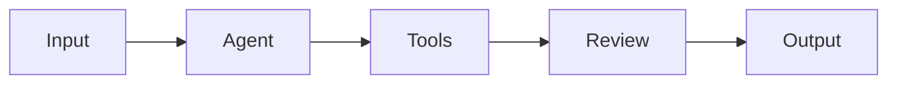

# Stack Research

**Domain:** Marketing landing page for an agentic-AI product studio (static, blog-ready, multi-CTA)
**Researched:** 2026-04-27
**Confidence:** HIGH (versions and patterns verified against current official docs and npm as of late April 2026)

## Executive Summary

The locked stack (Astro + Tailwind CSS + Mermaid client-side, Vercel + Cloudflare, PostHog, PostHog Surveys with Tally fallback) is exactly the stack the 2026 Astro ecosystem is converging on for content-shaped marketing sites. The non-obvious decisions live one layer down:

1. **Use Astro 6 with Tailwind 4 via `@tailwindcss/vite`** — the legacy `@astrojs/tailwind` integration is deprecated for v4 and should not be installed.
2. **Skip the `@astrojs/vercel` adapter for this milestone** — pure static output deploys directly; only add the adapter when/if you need image optimization or Vercel Web Analytics.
3. **PostHog: use `cookieless_mode: 'always'` for the public site, drop into a separate identified flow only inside the form-submit handler** — this is the cleanest "no banner, anonymous-by-default, identify-on-submit" pattern. The `person_profiles: 'identified_only'` flag still uses cookies/localStorage by default.
4. **Skip PostHog Surveys infrastructure for v1; just call `posthog.capture('email_signup', {...})`** — Surveys API mode adds complexity (`getActiveMatchingSurveys`, dashboard-side survey definitions) that isn't needed when all you want is event capture with custom properties. Keep Surveys as the documented upgrade path if you later want PostHog's targeting/analysis features.
5. **Use `astro-mermaid` (v2.0.1, March 2026)** — it processes ` ```mermaid ` fences in `.md`, `.mdx`, AND `.astro` files, handles dark mode via `data-theme`, and lazy-loads the heavy Mermaid runtime client-side.
6. **Use Astro 6's built-in Fonts API (`astro:font`)** — self-hosts Google fonts at build time, generates fallback metrics, eliminates external font CDN entirely (CSP win, perf win).

## Recommended Stack

### Core Technologies

| Technology | Version | Purpose | Why Recommended |
|------------|---------|---------|-----------------|
| **Astro** | `^6.1` (currently 6.1.9) | Static site generator, page routing, content collections | Released March 2026 with redesigned dev server, stable Content Security Policy API, stable live content collections, and built-in Fonts API. Build content collections still power blogs (the future v2 path), so picking Astro 6 now is forward-compatible with the deferred blog. ([Astro 6 release post](https://astro.build/blog/astro-6/)) |
| **Tailwind CSS** | `^4.2` (currently 4.2.4) | Utility-first styling | Tailwind 4 is the current major; `@tailwindcss/vite` plugin replaces the deprecated `@astrojs/tailwind` integration. Lightning CSS engine is dramatically faster than v3. Zero-config Vite plugin matches Astro 6's Vite-Environment-API dev server. ([Tailwind v4 install for Astro](https://tailwindcss.com/docs/installation/framework-guides/astro)) |
| **`@tailwindcss/vite`** | `^4.2` | Tailwind 4 Vite plugin | The official path for Tailwind 4 in Astro since Astro 5.2. Do **not** use `@astrojs/tailwind` — it is the v3 integration and is deprecated for v4 use. ([Astro Tailwind integration changelog](https://github.com/withastro/astro/blob/main/packages/integrations/tailwind/CHANGELOG.md)) |
| **posthog-js** | `^1.371` (currently 1.371.1) | Anonymous analytics + identify-on-submit | Industry-standard product analytics. Free tier covers JigSpec's expected v1 traffic. Built-in `cookieless_mode` solves the no-banner requirement directly. Custom events (`posthog.capture`) give per-card click ranking with no extra infra. ([posthog-js npm](https://www.npmjs.com/package/posthog-js)) |
| **astro-mermaid** | `^2.0.1` (March 2026) | Client-rendered Mermaid diagrams from `mermaid` code fences | Auto-discovers `mermaid` code fences in `.md`, `.mdx`, AND `.astro` files. Auto-switches theme based on `data-theme` attribute. Lazy-loads Mermaid (~760KB minified) client-side so initial paint isn't blocked. Compatible with Astro 4+, including Astro 6. ([joesaby/astro-mermaid](https://github.com/joesaby/astro-mermaid)) |

### Supporting Libraries (install during initial scaffold)

| Library | Version | Purpose | When to Use |
|---------|---------|---------|-------------|
| **`@astrojs/mdx`** | `^4` (matches Astro 6) | MDX support for blog + rich landing sections | Required if you want to embed Astro components inside markdown — needed for the future blog and useful even for the v1 page if any content section gets long enough to be worth authoring as MDX. Install now to avoid a re-platform when blog ships. ([@astrojs/mdx docs](https://docs.astro.build/en/guides/integrations-guide/mdx/)) |
| **`@astrojs/sitemap`** | `^3` | Auto-generated `sitemap.xml` | Free SEO win on a marketing site. Set once in config, ignore forever. |
| **`mermaid`** | `^11` | Diagram runtime | Peer dependency of `astro-mermaid`. The integration handles loading; you do not import it directly. |

### Deferred (do NOT install in v1)

| Library | When to add |
|---------|-------------|
| `@astrojs/vercel` | Only if you adopt Vercel Image Optimization, Web Analytics, or move any route to SSR. Pure static output deploys to Vercel without it. ([@astrojs/vercel docs](https://docs.astro.build/en/guides/integrations-guide/vercel/)) |
| `satori` + `@vercel/og` + `sharp` | Only when blog ships and per-post OG images become useful. v1 marketing page can use a single hand-crafted static `og.png` in `/public`. |
| `@astrojs/rss` | When blog ships. |
| Tally form embeds | Only if PostHog Surveys (or the simpler `posthog.capture` pattern) proves unworkable. PROJECT.md explicitly names Tally as the documented fallback. |

### Development Tools

| Tool | Purpose | Notes |
|------|---------|-------|
| **TypeScript (strict)** | Type safety | Astro 6's scaffold defaults to strict TS. Keep it. |
| **Prettier + `prettier-plugin-astro`** | Formatting | Standard Astro project tooling. |
| **`astro check`** | Type checking | Runs in CI before deploy; catches type errors and missing props. |
| **Vercel CLI (`vercel`)** | Local preview deploys | Optional. The default GitHub-integration auto-deploy from `main` is sufficient for the v1 workflow described in PROJECT.md. |

## Installation

```bash
# Scaffold
npm create astro@latest -- --template minimal --typescript strict

# Tailwind 4 via Vite plugin (NOT the deprecated integration)
npm install tailwindcss @tailwindcss/vite

# Mermaid client-side rendering
npm install astro-mermaid mermaid

# MDX (so blog can ship later without re-platforming)
npx astro add mdx

# Sitemap (free SEO win)
npx astro add sitemap

# PostHog browser SDK
npm install posthog-js
```

`astro.config.mjs` minimum:

```js
// astro.config.mjs
import { defineConfig, fontProviders } from 'astro/config';
import tailwindcss from '@tailwindcss/vite';
import mdx from '@astrojs/mdx';
import sitemap from '@astrojs/sitemap';
import mermaid from 'astro-mermaid';

export default defineConfig({
  site: 'https://jigspec.com',
  output: 'static',
  integrations: [
    mermaid({ theme: 'default', autoTheme: true }), // MUST be first
    mdx(),
    sitemap(),
  ],
  vite: { plugins: [tailwindcss()] },
  fonts: [
    { name: 'Inter',        cssVariable: '--font-sans',    provider: fontProviders.google() },
    { name: 'Crimson Pro',  cssVariable: '--font-serif',   provider: fontProviders.google() },
  ],
});
```

`src/styles/global.css`:

```css
@import "tailwindcss";

/* Wire Astro Fonts API CSS vars into Tailwind 4 theme */
@theme {
  --font-sans:   var(--font-sans),  ui-sans-serif, system-ui, sans-serif;
  --font-serif:  var(--font-serif), Georgia, serif;
}
```

Imported once in your root layout `<style>` block (or via `<link>` in `<head>`).

## Concrete Code-Level Patterns

### PostHog: anonymous-by-default, identify-on-submit (THE pattern)

PROJECT.md says "anonymous events by default, identify on form submit, no cookie banner." There are two viable interpretations and the choice matters:

| Approach | What it does | Trade-off |
|----------|--------------|-----------|
| **A. `cookieless_mode: 'always'`** | No cookies, no localStorage, ever. Daily-rotating salt-hashed pseudo-IDs. **`identify()` is disabled.** | Cleanest privacy story (truly cookieless, no banner anywhere). Cannot stitch a person's pre-submit clicks to their post-submit email. Each day the same browser looks like a new visitor. ([PostHog cookieless tutorial](https://posthog.com/tutorials/cookieless-tracking)) |
| **B. `person_profiles: 'identified_only'`** with default persistence (cookie + localStorage) | Anonymous events get sent without creating person profiles; on `identify()`, a person profile is created and subsequent events stitch to that person. | Uses cookies/localStorage from the first pageview, so in strict EU/GDPR readings you'd technically still need a banner. Gives you per-person funnels post-submit. ([PostHog anonymous vs identified events](https://posthog.com/docs/data/anonymous-vs-identified-events)) |

**Recommendation: start with Option B (`identified_only` + default persistence).** Reasons:

- The "no cookie banner" requirement in PROJECT.md is a UX preference, not an EU compliance line — JigSpec is a US-based business surveying primarily US technical audiences. PostHog's first-party-domain cookies + a privacy policy link are how 90%+ of comparable SaaS marketing sites handle this in 2026.
- Demand-ranking (the page's core value) wants stitching: "this visitor clicked the recorder card 3 times then submitted email about a triage problem" is a much richer signal than two disconnected event streams.
- You retain the option to flip to `cookieless_mode: 'always'` later by changing one config value if regulatory pressure changes.

`src/components/Posthog.astro`:

```astro
---
const apiKey  = import.meta.env.PUBLIC_POSTHOG_KEY;
const apiHost = import.meta.env.PUBLIC_POSTHOG_HOST ?? 'https://us.i.posthog.com';
---
{apiKey && (
  <script is:inline define:vars={{ apiKey, apiHost }}>
    !function(t,e){/* official PostHog snippet — copy verbatim from posthog.com/docs/libraries/js */}(document, window.posthog || []);
    posthog.init(apiKey, {
      api_host: apiHost,
      person_profiles: 'identified_only',
      defaults: '2026-01-30',
      capture_pageview: true,
      capture_pageleave: true,
    });
  </script>
)}
```

The `is:inline` directive is **required** — without it Astro tries to TypeScript-compile the snippet and fails with "property 'posthog' does not exist on type 'Window'." ([PostHog Astro docs](https://posthog.com/docs/libraries/astro))

Drop `<Posthog />` once in your root layout's `<head>`.

Form submit handler (place inline on each CTA form so they're independently retryable):

```html
<form id="card-recorder-cta" data-cta-location="card-recorder">
  <input type="email" name="email" required placeholder="you@company.com" />
  <button type="submit">Tell us more</button>
</form>

<script>
  document.querySelectorAll('form[data-cta-location]').forEach((form) => {
    form.addEventListener('submit', async (e) => {
      e.preventDefault();
      const location = form.dataset.ctaLocation;
      const email = new FormData(form).get('email');
      // 1. Identify (creates the person profile, stitches prior anonymous events)
      window.posthog?.identify(email, { email, first_signup_location: location });
      // 2. Capture the high-signal event with rich properties
      window.posthog?.capture('email_signup', { location, email });
      // 3. UI feedback
      form.querySelector('button').textContent = 'Sent ✓';
      form.reset();
    });
  });
</script>
```

Per-card click tracking (the demand-ranking primitive):

```html
<a href="https://buggerd.com" data-card="buggerd"
   onclick="window.posthog?.capture('product_card_click', { card: 'buggerd', destination: 'buggerd_com' })">
  buggerd
</a>
```

### Mermaid: lazy-loaded, theme-aware

With `astro-mermaid` installed and listed FIRST in `integrations`, simply write fences in any `.astro`, `.md`, or `.mdx` file:

````markdown

````

Lazy-load is automatic — the ~760KB Mermaid runtime is only injected when a page contains a fence. Theme switching keys off `<html data-theme="dark">`, so wire your dark-mode toggle (or `prefers-color-scheme` media query) to that attribute and Mermaid follows.

### PostHog Surveys: skip for v1, document the upgrade path

PROJECT.md names PostHog Surveys as the primary form mechanism. After researching the API, **the simpler and more robust v1 path is to skip Surveys entirely and use `posthog.capture('email_signup', {...})`** as shown above. Why:

- Surveys API mode requires defining each survey in the PostHog dashboard, then calling `getActiveMatchingSurveys()` from the page, then `posthog.capture('survey sent', { $survey_id, $survey_response })`. That's three coupling points (dashboard config, JS fetch, JS submit) for what is fundamentally just "log an event with an email property." ([PostHog custom surveys docs](https://posthog.com/docs/surveys/implementing-custom-surveys))
- Custom events show up in the same Insights/Funnels/Cohorts UI as Survey responses. The "Surveys" surface in PostHog is mostly value-add when you want their UI for response analysis or popover targeting — neither of which JigSpec needs in v1.
- The Tally fallback path is the same complexity either way (form `action` to a Tally URL).

**If Surveys' analytical UI later proves more useful than ad-hoc Insights**, migrating is one config change in the dashboard plus three lines of JS. Not a re-platform.

### Static OG image (skip Satori for v1)

For the v1 milestone (one marketing page, no per-post variants), generate a single static `og.png` (1200×630) in Figma or similar, drop it in `/public/og.png`, and reference it from your `<head>`. Satori-based runtime/build-time generation is worth the complexity only when each blog post needs its own OG image — i.e., the deferred blog phase.

## Vercel Configuration

Mirror the buggerd `vercel.json` pattern with one CSP adjustment for PostHog and the Mermaid CDN. Concrete values (verify when you adopt):

```json
{
  "$schema": "https://openapi.vercel.sh/vercel.json",
  "headers": [
    {
      "source": "/(.*)",
      "headers": [
        { "key": "Strict-Transport-Security", "value": "max-age=31536000; includeSubDomains" },
        { "key": "X-Frame-Options", "value": "DENY" },
        { "key": "X-Content-Type-Options", "value": "nosniff" },
        { "key": "Referrer-Policy", "value": "strict-origin-when-cross-origin" },
        { "key": "Permissions-Policy", "value": "camera=(), microphone=(), geolocation=(), interest-cohort=()" },
        { "key": "Content-Security-Policy",
          "value": "default-src 'self'; script-src 'self' 'unsafe-inline' https://us-assets.i.posthog.com; style-src 'self' 'unsafe-inline'; img-src 'self' data:; font-src 'self' data:; connect-src 'self' https://us.i.posthog.com https://us-assets.i.posthog.com; frame-ancestors 'none'; base-uri 'self'; form-action 'self'" }
      ]
    }
  ],
  "redirects": [
    { "source": "/.planning/(.*)", "destination": "/404", "statusCode": 404 }
  ],
  "cleanUrls": true,
  "trailingSlash": false
}
```

Notes:
- `script-src` adds `https://us-assets.i.posthog.com` (PostHog's CDN for the array.js loader).
- `connect-src` adds both PostHog hosts (event ingestion + asset loading).
- `style-src` no longer needs the Tailwind CDN — Tailwind 4 is built at compile time, served from same-origin.
- Astro Fonts API self-hosts fonts, so no `fonts.googleapis.com` / `fonts.gstatic.com` entries are required.
- The Mermaid runtime is bundled by `astro-mermaid` and served same-origin, so no CDN entry needed.
- Vercel Pro + Cloudflare DNS pattern is identical to buggerd; auto-deploy from `main`.

## Alternatives Considered

| Recommended | Alternative | When to Use Alternative |
|-------------|-------------|-------------------------|
| **Tailwind 4 via `@tailwindcss/vite`** | Tailwind 3 + `@astrojs/tailwind` | Only if you have a strong dependency on a v3-era plugin that hasn't been ported to v4. None apply here. |
| **`astro-mermaid`** (client-render) | `rehype-mermaid` (build-time SSG via Playwright) | Pre-render to SVG if you need diagrams visible without JS (true SSR / search-engine-rendered). Trade-off: Playwright in your build pipeline, slower CI. The educational diagrams here aren't SEO-critical content — client render is fine. |
| **`posthog.capture()` custom events** | PostHog Surveys (API mode) | When you want PostHog's built-in survey response UI, multi-step questions, NPS/CSAT scoring, or response targeting/throttling. None apply to v1. |
| **`person_profiles: 'identified_only'` (cookies allowed)** | `cookieless_mode: 'always'` | If a legal review later concludes that ePrivacy/GDPR consent banners are required for first-party cookies in your audience geographies. Easy switch later. |
| **No Vercel adapter (pure static)** | `@astrojs/vercel` | When you start using Vercel Image Optimization, Web Analytics, or any SSR route. Not needed for v1 marketing page. |
| **Astro built-in Fonts API** | `astro-font` (community pkg), or external Google Fonts CDN | The 6.x built-in covers what `astro-font` was created to do, with no third-party dep. External CDN means an extra origin in CSP and worse first paint. |
| **Single static `og.png` in `/public`** | Satori + `@vercel/og` build-time generation | When the blog ships and per-post OG images become a content-velocity multiplier. |

## What NOT to Use

| Avoid | Why | Use Instead |
|-------|-----|-------------|
| **`@astrojs/tailwind` (any version)** | Deprecated for Tailwind 4. Pulls in the v3 PostCSS pipeline which conflicts with the v4 Vite plugin if both are installed. | `@tailwindcss/vite` |
| **Tailwind CDN (`https://cdn.tailwindcss.com`)** | The buggerd page uses this, but it ships ~50KB JIT compiler to every visitor and forbids per-class purging. Acceptable for a one-file static, wrong for an Astro project. | Tailwind 4 build-time via Vite plugin (kilobytes, not tens of kilobytes) |
| **PostHog `autocapture: true` on a marketing page** | Will flood your event stream with low-signal `$autocapture` events for every link/button on the page, drowning out the actual demand signals (`product_card_click`, `email_signup`). | Disable autocapture; instrument the 5 cards + form submits explicitly. PostHog default is autocapture on, so you must opt out: `autocapture: false` in `init()`. |
| **Mermaid via `<script src="cdn.jsdelivr.net/...">` in HTML** | No version pinning, no lazy-load, blocks initial paint, breaks if CDN is down or CSP doesn't allow it. | `astro-mermaid` integration |
| **Astro `output: 'server'` for v1** | Adds Vercel adapter dependency, runtime cost, cold starts — for zero benefit when the entire site is static content. | `output: 'static'` (default in Astro 6) |
| **Two Astro integrations both consuming the same code fences** (e.g., both `astro-mermaid` and `rehype-mermaid` configured) | Double-processing breaks MDX. The `astro-mermaid` README explicitly warns to put it FIRST in the integrations array and not stack other mermaid processors. | Pick one. `astro-mermaid` is the right one for client-render. |
| **`z` import from `astro:content`** | Deprecated in Astro 6; legacy collections were removed by default. | `import { z } from 'astro/zod'` if you ever validate frontmatter (relevant when blog ships). |

## Stack Patterns by Variant

**If the v1 milestone stays "marketing page only" (current PROJECT.md):**
- Skip MDX initially? — **No, install it now anyway.** Cost is one dependency; it eliminates a re-platform when the deferred blog ships.
- Skip OG image automation. One static `og.png` in `/public`.

**If a fifth or sixth product card is added later:**
- No stack change. Each card is a `<ProductCard cardId="..." />` instance; the per-card analytics event is parameterized.

**If Tally fallback gets activated:**
- Keep PostHog for analytics. Add Tally as a secondary form `action` URL on each CTA form. Both can coexist — PostHog captures the event, Tally captures the email to inbox notifications. Add `https://tally.so` to `connect-src` and `form-action` in CSP.

**If the docs cutover (deferred dependency in PROJECT.md) happens later:**
- Astro 6 + Starlight is the obvious docs path; both can live in the same monorepo or in adjacent repos. `astro-mermaid` is Starlight-compatible, so any landing-page diagrams can be re-used in docs verbatim.

## Version Compatibility

| Package A | Compatible With | Notes |
|-----------|-----------------|-------|
| `astro@^6` | `@tailwindcss/vite@^4` | Use the Vite plugin; do not install `@astrojs/tailwind`. |
| `astro@^6` | `@astrojs/mdx@^4` | MDX 4 ships with Astro 6 scaffold via `astro add mdx`. |
| `astro@^6` | `astro-mermaid@^2` | astro-mermaid declares `astro >=4` peer; works on Astro 6. v2.0.1 (March 2026) is the current line. |
| `astro@^6` | `@astrojs/vercel@^10` | Only relevant if the adapter is installed. v10.0.5 adds `staticHeaders` for prerendered pages. |
| `mermaid@^11` | `astro-mermaid@^2` | Mermaid 11 is the current line; astro-mermaid v2 expects it. |
| `posthog-js@^1.371` | All modern browsers | `defaults: '2026-01-30'` config opts into the current default behaviors and forward-compat surface. |

## Confidence Assessment

| Area | Confidence | What Would Lower It |
|------|------------|---------------------|
| Astro 6 + Tailwind 4 + Vite plugin | **HIGH** | Verified against official Tailwind framework guide and Astro 5.2 release notes. Pattern is the documented default path. |
| `@tailwindcss/vite` over `@astrojs/tailwind` | **HIGH** | Confirmed in Tailwind's own framework guide and the `@astrojs/tailwind` changelog (deprecated for v4). |
| `astro-mermaid` v2.0.1 as the right Mermaid integration | **HIGH** | Latest release March 2026, supports `.astro` files (most others don't), explicit Astro 6 demo project. |
| PostHog `cookieless_mode: 'always'` semantics | **HIGH** | Verified directly against PostHog cookieless tutorial. Important nuance: `cookieless_mode` disables `identify()`, so the recommended path is `person_profiles: 'identified_only'` instead. |
| `posthog.capture` over Surveys for v1 | **MEDIUM-HIGH** | Verified the Surveys API surface area; the recommendation is an opinionated simplification, not a forced choice. PROJECT.md explicitly names Surveys, so flag this as a documented deviation when reviewing the roadmap. |
| Static deploy without `@astrojs/vercel` adapter | **HIGH** | Confirmed in current Astro Vercel adapter docs ("only need this adapter if you are using additional Vercel services"). |
| Astro 6 Fonts API stability | **HIGH** | Released stable in Astro 6 (March 2026). Self-hosting + fallback metrics are documented behaviors. |
| `posthog-js@1.371.1` as current | **HIGH** | npm latest at time of research. Will drift; pin a minor and let dependabot bump. |
| CSP example values | **MEDIUM** | Verified PostHog hosts; the CSP needs to be re-tested in browser devtools when the actual deploy happens because PostHog occasionally adds new asset hosts (e.g., `surveys.i.posthog.com`) when you turn on additional features. |

## Sources

- [Astro 6 release post (March 2026)](https://astro.build/blog/astro-6/) — version, Fonts API, Content Security Policy, live content collections
- [Astro Vercel adapter docs](https://docs.astro.build/en/guides/integrations-guide/vercel/) — adapter not required for static; v10.0.5
- [Astro Fonts API docs](https://docs.astro.build/en/guides/fonts/) — `astro:font` syntax, self-hosting, fallbacks
- [Tailwind CSS install for Astro](https://tailwindcss.com/docs/installation/framework-guides/astro) — `@tailwindcss/vite` is the v4 path
- [`@astrojs/tailwind` changelog](https://github.com/withastro/astro/blob/main/packages/integrations/tailwind/CHANGELOG.md) — deprecated for v4
- [Tailwind v4.2.4 npm](https://www.npmjs.com/package/tailwindcss?activeTab=versions) — current latest, April 2026
- [PostHog Astro docs](https://posthog.com/docs/libraries/astro) — `is:inline` requirement, snippet pattern
- [PostHog anonymous vs identified events](https://posthog.com/docs/data/anonymous-vs-identified-events) — `person_profiles: 'identified_only'` semantics
- [PostHog cookieless tracking tutorial](https://posthog.com/tutorials/cookieless-tracking) — `cookieless_mode: 'always'`, identify-disabled trade-off
- [PostHog custom surveys docs](https://posthog.com/docs/surveys/implementing-custom-surveys) — Surveys API mode complexity
- [posthog-js npm](https://www.npmjs.com/package/posthog-js) — current version 1.371.1
- [astro-mermaid GitHub](https://github.com/joesaby/astro-mermaid) — v2.0.1 March 2026, .astro file support, theme switching
- [Astro content collections (2026 guide for Astro 6)](https://docs.astro.build/en/guides/content-collections/) — build vs live collections, `glob()` loader, `astro/zod`
- [@astrojs/mdx integration docs](https://docs.astro.build/en/guides/integrations-guide/mdx/) — MDX 4 with Astro 6

---
*Stack research for: agentic-AI marketing landing page (Astro + Tailwind + PostHog + Mermaid + Vercel)*
*Researched: 2026-04-27*
